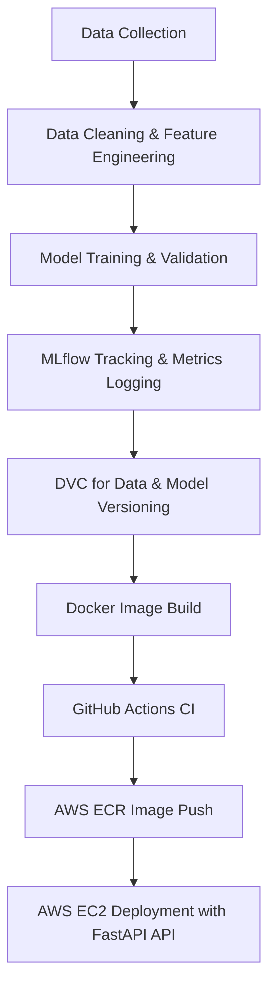

#  Zomato & Swiggy Delivery Time Prediction using MLOps

### 🚀 Overview

This project predicts the **delivery time** of food orders placed via **Zomato** and **Swiggy** using advanced **Machine Learning** and **MLOps** concepts.
It automates every stage of the ML lifecycle — from **data collection → training → tracking → deployment** — ensuring full reproducibility and scalability.

---

## 🎯 Problem Statement

Food delivery services face delays due to traffic, distance, and restaurant load.  
Accurate delivery time prediction helps in:
- Improving customer satisfaction  
- Optimizing delivery partner allocation  
- Enhancing overall operational efficiency

---

## 🧩 Tech Stack

| Category                     | Tools & Technologies        |
| ---------------------------- | --------------------------- |
| **Programming**              | Python                      |
| **Framework**                | FastAPI                     |
| **Modeling**                 | Scikit-learn, Pandas, NumPy |
| **Tracking**                 | MLflow, DVC, Dagshub        |
| **Version Control**          | Git + DVC                   |
| **Pipeline Automation (CI)** | GitHub Actions              |
| **Containerization**         | Docker                      |
| **Cloud Deployment**         | AWS EC2 + AWS ECR           |
| **Visualization**            | Matplotlib, Seaborn         |

---

## ⚙️ MLOps Lifecycle

### 🔁 End-to-End Pipeline



✅ **Concepts Implemented:**

* **Version Control (Git + DVC):** Tracks data & model versions.
* **Experiment Tracking (MLflow):** Logs parameters, metrics & models.
* **Continuous Integration (GitHub Actions):** Automates linting, testing, and image building.
* **Containerization (Docker):** Reproducible runtime environments.
* **Deployment (AWS EC2):** Scalable REST API using FastAPI.

---

## 🧠 Model Features

* Delivery distance
* Order value
* Restaurant rating
* Weather condition
* Traffic level
* Time of order (rush hour, weekend, etc.)

---

## 📊 Model Performance Metrics

|     Metric    |     Value    |
| :-----------: | :----------: |
|  **Train R²** |    0.8916    |
|  **Test R²**  |    0.8376    |
| **Train MAE** | 2.47 minutes |
|  **Test MAE** | 3.01 minutes |
|  **CV Score** | 3.07 minutes |

📈 The model shows strong generalization with minimal overfitting and high predictive accuracy.

---

## 📸 Visuals & Screenshots

### 🧮 MLflow Experiment Tracking


Tracks model runs, parameters, and metrics automatically for each training cycle.

---

### 📦 CI Pipeline (GitHub Actions)


Every code push triggers **CI pipeline** → runs tests → builds Docker image → pushes to AWS ECR.

---

### 🧮 Data & DVC Pipeline (Dagshub)


---

### 🌐 Live FastAPI App


---

## 🧱 CI/CD Pipeline Highlights

✅ **Continuous Integration (CI):**

* Triggered on every push or pull request
* Runs unit tests automatically
* Builds Docker image
* Pushes image to AWS ECR

✅ **Continuous Deployment (Optional):**

* EC2 instance pulls the latest image
* Runs containerized FastAPI service

---

## 🐳 Docker Deployment Steps

```bash
# Build Docker Image
docker build -t delivery_time_prediction .

# Tag for ECR
docker tag delivery_time_prediction:latest <aws_account_id>.dkr.ecr.<region>.amazonaws.com/zomato_swiggy_delivery_time_prediction:latest

# Push to ECR
docker push <aws_account_id>.dkr.ecr.<region>.amazonaws.com/zomato_swiggy_delivery_time_prediction:latest

# Run on EC2
docker run -d -p 8000:8000 <aws_account_id>.dkr.ecr.<region>.amazonaws.com/zomato_swiggy_delivery_time_prediction:latest
```

---

## 🧠 Results Summary

✅ High model accuracy with R² = **0.83+**                                                                                          
✅ Fully automated data & model tracking using **MLflow**                                                 
✅ Reproducible pipeline with **DVC + GitHub Actions + Docker**                                                                              
✅ Successful **AWS EC2 deployment**                                              
✅ Real-time inference available via FastAPI endpoint                                                        

---

## 💡 Future Enhancements

* Integrate **real-time traffic & weather API** for live updates.
* Add **CD pipeline** for auto-deployment on model updates.
* Implement **Grafana dashboards** for real-time monitoring.
* Extend deployment to **AWS Lambda + API Gateway** for serverless scaling.


## 📁 Folder Structure

------------

    ├── LICENSE
    ├── Makefile           <- Makefile with commands like `make data` or `make train`
    ├── README.md          <- The top-level README for developers using this project.
    ├── data
    │   ├── external       <- Data from third party sources.
    │   ├── interim        <- Intermediate data that has been transformed.
    │   ├── processed      <- The final, canonical data sets for modeling.
    │   └── raw            <- The original, immutable data dump.
    │
    ├── docs               <- A default Sphinx project; see sphinx-doc.org for details
    │
    ├── models             <- Trained and serialized models, model predictions, or model summaries
    │
    ├── notebooks          <- Jupyter notebooks. Naming convention is a number (for ordering),
    │                         the creator's initials, and a short `-` delimited description, e.g.
    │                         `1.0-jqp-initial-data-exploration`.
    │
    ├── references         <- Data dictionaries, manuals, and all other explanatory materials.
    │
    ├── reports            <- Generated analysis as HTML, PDF, LaTeX, etc.
    │   └── figures        <- Generated graphics and figures to be used in reporting
    │
    ├── requirements.txt   <- The requirements file for reproducing the analysis environment, e.g.
    │                         generated with `pip freeze > requirements.txt`
    │
    ├── setup.py           <- makes project pip installable (pip install -e .) so src can be imported
    ├── src                <- Source code for use in this project.
    │   ├── __init__.py    <- Makes src a Python module
    │   │
    │   ├── data           <- Scripts to download or generate data
    │   │   └── make_dataset.py
    │   │
    │   ├── features       <- Scripts to turn raw data into features for modeling
    │   │   └── build_features.py
    │   │
    │   ├── models         <- Scripts to train models and then use trained models to make
    │   │   │                 predictions
    │   │   ├── predict_model.py
    │   │   └── train_model.py
    │   │
    │   └── visualization  <- Scripts to create exploratory and results oriented visualizations
    │       └── visualize.py
    │
    └── tox.ini            <- tox file with settings for running tox; see tox.readthedocs.io


--------

## 📬 Contact
--------
* 📧 Email: laxmikantbabaleshwar07@gmail.com
* 🌐 GitHub: github.com/Laxmikant-SB
* 📍 Location: India
--------